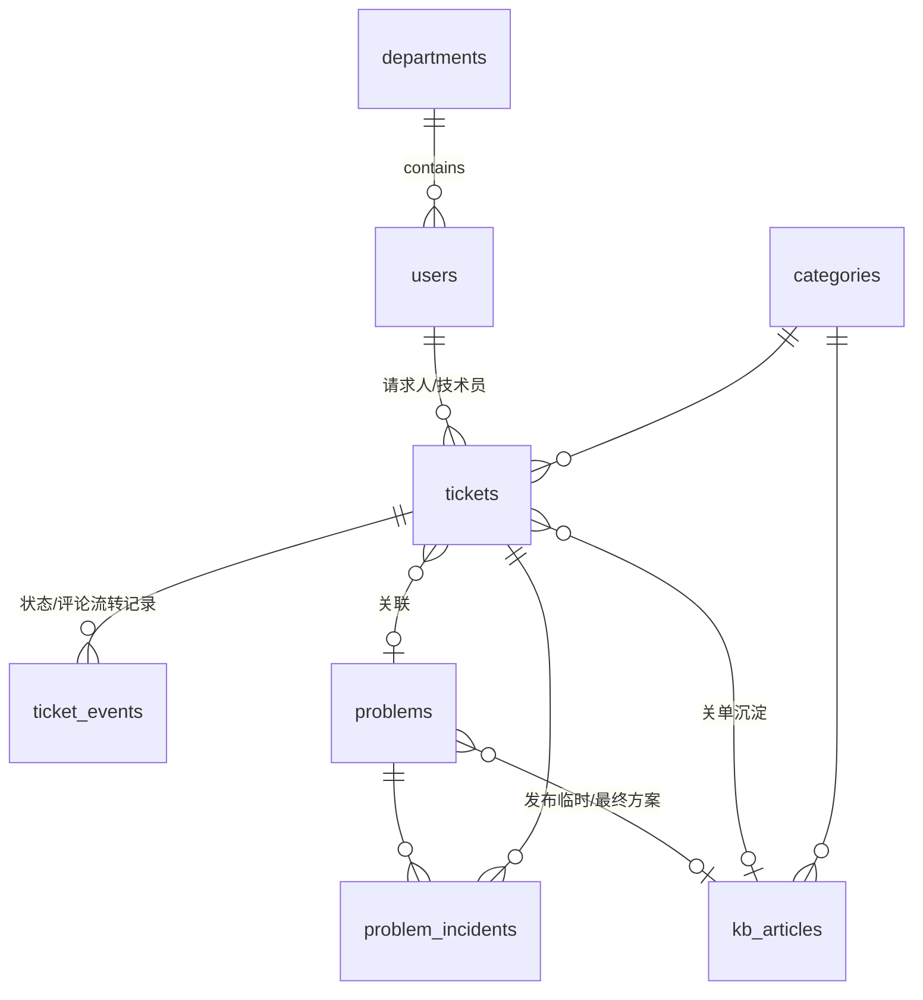

# 小而美 IT 服务台（企微版）— 产品设计方案

> 版本：v1.0 草案 ｜ 2026-07-25
> 定位：基于前两轮对 ManageEngine ServiceDesk Plus 的调研与实测（见 `research/`），做的**减法设计**。
> 一句话：**企业微信原生的小而美 IT 服务台 —— 事件管理 + 问题管理 + 知识库，用户体系完全绑定企微。**

---

## 一、产品定位与设计哲学

### 1.1 定位

- **目标用户**：50–500 人规模、IT 团队 1–10 人、全员在企业微信中的公司。
- **核心价值**：员工在企微里 30 秒提单，IT 在企微里接单处理，知识和问题自然沉淀。
- **与 SDP 等重型 ITSM 的关系**：不是"缩小版 SDP"，而是**重新设计**。SDP 实测（`research/hands-on/`）证明重型产品对中小团队的三大门槛：配置复杂（管理员一周上手）、信息密度高、大量模块用不上。我们反着做：**开箱即用、默认配置即可跑、零培训**。

### 1.2 设计原则（每一条都对应实测发现的竞品痛点）

| # | 原则 | 对应痛点（实测证据） |
|---|------|---------------------|
| 1 | **企微即入口**：提单/接单/审批/通知全在企微内闭环 | SDP 移动端只有 Google Play 直链，国内不可达；无企微原生集成 |
| 2 | **默认即最佳实践**：状态机、优先级、分类预置好，能不改就不改 | GLPI/SDP 配置体系复杂，上手成本高 |
| 3 | **知识沉淀零成本**：关单时一键转知识；已知错误全员可见 | SDP 的 KEDB 不对终端用户开放（已实测证实）——我们开放，做差异化 |
| 4 | **一页一屏**：每个页面只做一件事，移动端优先 | SDP 界面中英混杂、信息密度高 |
| 5 | **中文原生**：所有文案、日期、状态全中文，无翻译腔 | SDP 状态显示英文 "Open"、日期不本地化（实测 8 处实证） |

### 1.3 明确不做的（V1 排除清单）

变更管理、发布管理、CMDB、资产管理、采购合同、服务目录（用"固定几种请求类型"替代）、复杂 SLA 引擎（用"时限+提醒"替代）、多租户/ESM、报表中心（只留 3 张核心统计卡）。这些在路线图里留好扩展位，但 V1 一行代码都不写。

---

## 二、用户体系：完全绑定企业微信

### 2.1 模式：企业微信「自建应用」

- 在企微管理后台创建一个自建应用（如"IT 服务台"），员工在企微工作台点击即用。
- **没有独立注册/密码体系**，账号 = 企微身份。

### 2.2 四个集成点

| 能力 | 企微接口 | 用途 |
|------|---------|------|
| **组织架构同步** | 通讯录 API（部门列表 + 成员列表 + 增量变更回调） | 每日全量同步 + 回调实时同步；员工离职自动停用账号 |
| **免密登录** | OAuth2（`auth_code` 换 `userid`） | 企微内打开 H5 自动识别身份；Web 管理端用企微扫码登录 |
| **消息通知** | 应用消息 API（文本卡片 / 模板卡片） | 工单指派、状态变更、催办、超时提醒全部推送到企微会话 |
| **卡片交互** | 模板卡片按钮回调 | 技术员在企微消息卡片上直接「接单」「解决」「转交」，无需打开页面 |

### 2.3 三种角色（用企微数据映射，不搞独立权限系统）

| 角色 | 来源 | 能做什么 |
|------|------|---------|
| **员工**（默认） | 企微全员 | 提单、查自己的单、看知识库/已知错误、评价 |
| **技术员** | 企微「标签」或指定部门成员（如"IT 支持"标签） | + 接单/处理/转交/关闭、问题管理、知识库编辑 |
| **管理员** | 应用创建者或企微超管指定 | + 分类配置、人员标签绑定、数据查看 |

> 设计要点：权限判断只做"读企微标签/部门"一件事，不建 RBAC 体系。技术员分组（如网络组/桌面组）V1 用简单的"技能标签"字段实现。

---

## 三、事件管理（Incident）

### 3.1 状态机（极简 5 态，比 SDP 默认还少）

```
待处理 ──接单──▶ 处理中 ──解决──▶ 待确认 ──请求人确认/7天自动──▶ 已关闭
  │                 │                 │
  │                 └──挂起(等用户回复,停计时)◀──┤ (请求人打回→回到处理中)
  └──取消（请求人/技术员均可,需填原因）
```

- 状态全中文显示（对照：SDP 实测中列表状态仍显示英文 Open）。
- 「挂起」不计入处理时长（借鉴 iTop 的 pending 暂停语义）。
- 「待确认」超过 7 天自动关闭（可配置天数），关闭前企微提醒请求人一次。

### 3.2 提单表单（企微 H5，字段只有 6 个）

1. **问题分类**（两级：大类 → 小类，预置一套，见 3.4）
2. **问题描述**（多行文本；输入时实时推荐知识库文章/已知错误 → AI 分流入口）
3. **紧急程度**（三选一：不紧急 / 有点急 / 很急——内部映射优先级，不让用户选 P1–P4 术语）
4. **附件**（图片/文件，企微内直接拍照上传）
5. 联系人（默认自己，可代他人提交）
6. 提交 → 生成工单号（如 `INC-20260725-003`）

### 3.3 技术员工作台

- **企微端**：新单推送卡片 → 一键接单；处理中可回复（回复即同步给请求人企微）、挂起、解决（必填解决方案）、转交。
- **Web 管理端**：工单列表（我的待办 / 全部 / 已逾期 三个视图）、筛选、批量操作。看板视图 V1 不做，列表够用。

### 3.4 预置分类（开箱即用，可改）

```
网络问题（无法上网/网速慢/VPN/WiFi）
账号权限（账号申请/密码重置/权限开通/离职清理）
电脑设备（电脑故障/打印机/外设/系统重装）
软件应用（办公软件/业务系统/软件安装）
邮箱会议（邮箱/会议设备/投屏）
其他
```

### 3.5 优先级与时限（SLA-Lite，不做完整 SLA 引擎）

- 优先级 = 紧急程度 × 影响面（技术员接单时判断：仅我 / 多人 / 全公司），自动映射 P1–P4。
- 每级对应默认响应/解决时限（如 P1：15 分钟响应 / 4 小时解决），管理员可改一张表即可。
- 超时动作只有一个：**企微提醒**（技术员 + 管理员）。不做多级升级链——实测证明小团队用不上，V2 再考虑。

### 3.6 工单字段模型（完整清单，克制版）

| 字段 | 说明 |
|------|------|
| 单号、标题、描述、附件 | 基本 |
| 分类（大类/小类） | 两级 |
| 状态 | 3.1 五态 + 挂起 |
| 优先级 | 系统算，不可手填（保留覆盖开关给管理员） |
| 请求人 / 代提人 / 技术员 | 均为企微 userid |
| 响应时限 / 解决时限 / 实际响应时间 / 实际解决时间 | SLA-Lite |
| 解决方案 | 解决时必填（知识沉淀的原料） |
| 评价（1–5 星 + 留言） | 关闭后请求人可评，推送技术员 |
| 关联问题 ID | 可挂到问题单 |

---

## 四、问题管理（Problem）

> 定位：事件的"上游"。多个同类事件 → 一个根因问题。小团队的问题管理=**一张清单 + 结构化根因记录**，不做复杂流程。

### 4.1 核心机制

- **来源**：①技术员从事件详情页「升级为问题」；②手动新建；③（V2）同分类事件聚集自动提示。
- **状态机**：`调查中 → 已定位根因 → 已知错误 → 已解决`（4 态）。
- **结构化字段**（借鉴 SDP/iTop 的 RCA 表单，精简）：
  - 症状（现象描述）
  - 根本原因（RCA）
  - 临时方案（Workaround，可一键发布到知识库）
  - 最终解决方案（解决后沉淀到知识库）
- **关联事件**：一个问题可关联多张事件单；**问题解决时可选择"级联解决"所有关联事件**（学 iTop 父子级联，实现成本低价值高），关联事件的请求人自动收到企微通知。

### 4.2 已知错误库（KEDB）—— 差异化亮点

- 「已知错误」状态的问题 + 其临时方案，**对全体员工可见**（入口：企微端"知识库"页内的"已知问题"tab）。
- 提单时若分类匹配到已知错误，优先展示临时方案，提示"该问题 IT 已在处理中"，用户可选择"我也遇到了"（自动关联到问题单，IT 能看到受影响人数）而不是重复提单。
- 依据：实测证实 SDP 的 KEDB 不开放给终端用户（`research/hands-on/00-实测总结.md` 必核项裁决表）——开放 KEDB + "我也遇到了"机制是我们的明确差异点，能直接减少重复工单量。

---

## 五、知识库（简版）

### 5.1 范围克制

- **文章**：标题 + 富文本正文 + 分类 + 标签 + 附件。
- **分类**：与事件分类共用一套（降低维护成本），也可单独加"公告/制度"类。
- **来源三通道**：①关单时一键把"解决方案"转为知识文章（待技术员润色发布）；②问题的临时方案/最终方案一键发布；③直接撰写。
- **全员可读**，技术员可写，发布无需审批流（V1 信任技术员，留"草稿/已发布"两态即可）。

### 5.2 检索与分流

- 全文搜索（PostgreSQL 全文检索 + 中文分词即可，不上 ES）。
- **提单时推荐**：用户输入描述时，按关键词实时推荐 Top 3 知识文章 + 匹配已知错误 → 点"解决了我的问题"则不开单（埋点统计分流率）。
- 知识文章下有点赞/点踩 + "没解决？去提单"入口，形成闭环。

---

## 六、数据模型（核心表）



| 表 | 关键字段 |
|----|---------|
| `users` | userid（企微主键）、姓名、部门、头像、角色、技能标签、是否启用（随企微离职同步） |
| `departments` | 企微部门 id、名称、父级、排序 |
| `categories` | 两级树、图标、启用 |
| `tickets` | 见 3.6；`type` 字段预留（V1 恒为 incident） |
| `ticket_events` | 工单时间线：状态变更/评论/指派/附件，统一一张表（学 GLPI 时间线抽象） |
| `problems` | 状态、症状/根因/临时方案/最终方案、负责人、是否已知错误 |
| `problem_incidents` | 问题-事件关联 + "我也遇到了"标记数 |
| `kb_articles` | 标题、正文、分类、标签、来源（单据ID）、赞/踩、浏览量 |
| `sla_rules` | 优先级 → 响应/解决时限（一张配置表） |
| `notifications` | 企微消息发送记录（可重试、可审计） |
| `settings` | 企微 corpid/secret、自动关闭天数、时限表等 |

---

## 七、技术架构建议（轻量优先）

| 层 | 选型 | 理由 |
|----|------|------|
| 企微端 H5 | Vue 3 + Vite + Vant | 移动端组件库成熟、中文生态好 |
| Web 管理端 | 同一前端工程，响应式 + Element Plus / Ant Design Vue | 一套代码两个壳 |
| 后端 | Node.js (NestJS) 或 Java (Spring Boot) 模块化单体 | 按团队技术栈选；模块化单体便于后期拆 |
| 数据库 | PostgreSQL（JSONB 存扩展字段 + 全文检索） | 一库搞定结构化+检索，不上 ES（Zammad 四件套太重的教训） |
| 缓存/队列 | Redis（会话 + 企微消息异步发送队列） | 轻量 |
| 企微对接 | 回调加解密 + 通讯录同步 + 消息 API，封装为独立 adapter 模块 | 未来换钉钉/飞书只换 adapter |
| 部署 | Docker Compose 一键起（app + pg + redis） | "十分钟上线"即卖点；2 核 4GB 可跑 |

**AI 预留（V2）**：工单描述/解决方案结构化存储，知识库文章向量化字段预留 pgvector；提单分流、解决方案推荐、对话摘要后期接入国产大模型（BYOK 思路——SDP 中国区锁死 Qwen 且无自带 Key，我们的开放模型接入仍是差异点）。

---

## 八、页面清单

### 企微端 H5（员工 + 技术员）

| 页面 | 说明 |
|------|------|
| 首页（工作台） | 三个大按钮：我要提单 / 查知识 / 已知问题；技术员多一个"待我处理(n)" |
| 提单页 | 3.2 六字段 + 实时知识推荐 |
| 我的工单 | 状态筛选、进度条（物流式跟踪：已提交→已接单→处理中→待确认→完成） |
| 工单详情 | 时间线对话式呈现（学 Zammad 会话线程）、评价 |
| 处理页（技术员） | 回复/挂起/转交/解决/升级问题 |
| 知识库 | 分类浏览 + 搜索 + 已知问题 tab |
| 我的 | 个人信息、我提的/我处理的统计 |

### Web 管理端（技术员 + 管理员）

| 页面 | 说明 |
|------|------|
| 工作台 | 我的待办 / 今日新单 / 超时单 三张卡 + 快捷筛选 |
| 工单列表 | 表格视图、筛选、详情抽屉 |
| 问题列表 | 状态看板式列表（4 列） |
| 知识库管理 | 文章 CRUD、草稿/发布 |
| 统计 | 3 张卡：工单量趋势、平均响应/解决时长、满意度；不做报表中心 |
| 设置 | 分类管理、时限表、技术员标签绑定、企微同步状态 |

---

## 九、实施路线（建议 3 个迭代）

| 迭代 | 范围 | 验收标准 |
|------|------|---------|
| **M1（企微打通 + 事件管理）** | 企微自建应用、通讯录同步、免密登录、提单/接单/处理/关闭全流程、企微消息通知与卡片操作 | 一个真实部门试用一周：员工企微提单、IT 企微处理、通知全达 |
| **M2（问题 + 知识库）** | 问题管理全流程、已知错误库开放、"我也遇到了"、知识库 CRUD 与搜索、关单沉淀 | 知识分流率可统计；重复工单能通过"我也遇到了"归并 |
| **M3（打磨）** | SLA-Lite 超时提醒、满意度评价、3 张统计卡、提单实时推荐优化 | 月度运营数据可出；管理员 30 分钟内完成全部配置 |

---

## 十、与重型 ITSM 的功能映射备忘（后续扩展位）

| 未来可能扩展 | 预留设计 |
|-------------|---------|
| 服务目录 | tickets.type + 模板表 |
| 变更管理 | tickets.type=change + 独立状态机 |
| SLA 完整引擎 | sla_rules 表 → 独立 sla 模块 |
| 钉钉/飞书 | adapter 层隔离 |
| AI 能力 | pgvector 字段预留 + BYOK 模型网关 |
| 资产/CMDB | 不预留，真需要时挂外部系统（如 Snipe-IT）API 集成 |

---

### 附：设计依据索引

- 竞品实测证据：`research/hands-on/00-实测总结.md`（28 项必核裁决、中国区 DC 特有缺陷）
- 差异化建议原始版：`research/00-调研消化总报告.md` 第四节
- ITIL 流程底座：`research/05-itil-framework.md`（事件/问题/知识管理实践）
- 开源参照：GLPI 时间线抽象、iTop 级联解决与 pending 语义、Zammad 会话线程（`research/06~08`）
